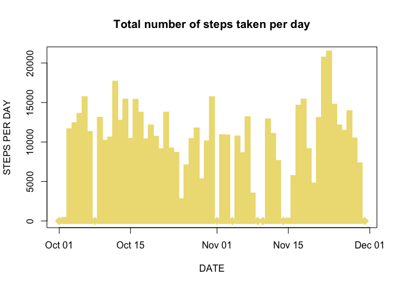
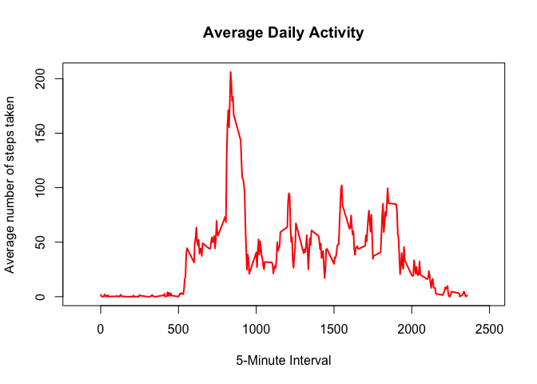
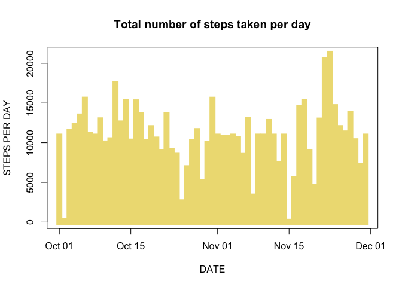
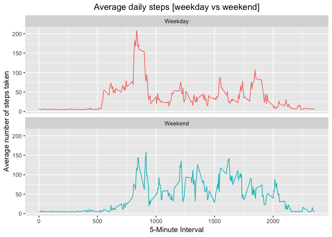

This assignment makes use of data from a personal activity monitoring device. 
This device collects data at 5 minute intervals through out the day. 
The data consists of two months of data from an anonymous individual collected during the months of October and November, 2012 and include the number of steps taken in 5 minute intervals each day.


Clear any lists, load libraries and data.


```r
knitr::opts_chunk$set(echo = TRUE)
rm(list = ls())
library(dplyr)
```

```
## 
## Attaching package: 'dplyr'
```

```
## The following objects are masked from 'package:stats':
## 
##     filter, lag
```

```
## The following objects are masked from 'package:base':
## 
##     intersect, setdiff, setequal, union
```

```r
library(ggplot2)
library(data.table)
```

```
## 
## Attaching package: 'data.table'
```

```
## The following objects are masked from 'package:dplyr':
## 
##     between, first, last
```

```r
activity <- read.csv("activity.csv")
```

Quick overview of data.


```r
str(activity)
```

```
## 'data.frame':	17568 obs. of  3 variables:
##  $ steps   : int  NA NA NA NA NA NA NA NA NA NA ...
##  $ date    : Factor w/ 61 levels "2012-10-01","2012-10-02",..: 1 1 1 1 1 1 1 1 1 1 ...
##  $ interval: int  0 5 10 15 20 25 30 35 40 45 ...
```

Transform the date column from factor to date format.


```r
activity$date <- as.Date(activity$date, format = "%Y-%m-%d")
lapply(activity, class) # check class of the data
```

```
## $steps
## [1] "integer"
## 
## $date
## [1] "Date"
## 
## $interval
## [1] "integer"
```

How much missing data?


```r
colMeans(is.na(activity))
```

```
##     steps      date  interval 
## 0.1311475 0.0000000 0.0000000
```

So there is some "steps" data missing.
Summary to get to know the data better.


```r
summary(activity)
```

```
##      steps             date               interval     
##  Min.   :  0.00   Min.   :2012-10-01   Min.   :   0.0  
##  1st Qu.:  0.00   1st Qu.:2012-10-16   1st Qu.: 588.8  
##  Median :  0.00   Median :2012-10-31   Median :1177.5  
##  Mean   : 37.38   Mean   :2012-10-31   Mean   :1177.5  
##  3rd Qu.: 12.00   3rd Qu.:2012-11-15   3rd Qu.:1766.2  
##  Max.   :806.00   Max.   :2012-11-30   Max.   :2355.0  
##  NA's   :2304
```

## Part 1: What is mean total number of steps taken per day (missing values ignored)?

### Calculate the total number of steps taken per day.


```r
total_steps <- with(activity, aggregate(steps, by = list(date), FUN = sum, na.rm = TRUE))
names(total_steps) <- c("date", "steps")
sum(total_steps$steps) # How many steps in total?
```

```
## [1] 570608
```

```r
total_steps # shows total steps per day
```

```
##          date steps
## 1  2012-10-01     0
## 2  2012-10-02   126
## 3  2012-10-03 11352
## 4  2012-10-04 12116
## 5  2012-10-05 13294
## 6  2012-10-06 15420
## 7  2012-10-07 11015
## 8  2012-10-08     0
## 9  2012-10-09 12811
## 10 2012-10-10  9900
## 11 2012-10-11 10304
## 12 2012-10-12 17382
## 13 2012-10-13 12426
## 14 2012-10-14 15098
## 15 2012-10-15 10139
## 16 2012-10-16 15084
## 17 2012-10-17 13452
## 18 2012-10-18 10056
## 19 2012-10-19 11829
## 20 2012-10-20 10395
## 21 2012-10-21  8821
## 22 2012-10-22 13460
## 23 2012-10-23  8918
## 24 2012-10-24  8355
## 25 2012-10-25  2492
## 26 2012-10-26  6778
## 27 2012-10-27 10119
## 28 2012-10-28 11458
## 29 2012-10-29  5018
## 30 2012-10-30  9819
## 31 2012-10-31 15414
## 32 2012-11-01     0
## 33 2012-11-02 10600
## 34 2012-11-03 10571
## 35 2012-11-04     0
## 36 2012-11-05 10439
## 37 2012-11-06  8334
## 38 2012-11-07 12883
## 39 2012-11-08  3219
## 40 2012-11-09     0
## 41 2012-11-10     0
## 42 2012-11-11 12608
## 43 2012-11-12 10765
## 44 2012-11-13  7336
## 45 2012-11-14     0
## 46 2012-11-15    41
## 47 2012-11-16  5441
## 48 2012-11-17 14339
## 49 2012-11-18 15110
## 50 2012-11-19  8841
## 51 2012-11-20  4472
## 52 2012-11-21 12787
## 53 2012-11-22 20427
## 54 2012-11-23 21194
## 55 2012-11-24 14478
## 56 2012-11-25 11834
## 57 2012-11-26 11162
## 58 2012-11-27 13646
## 59 2012-11-28 10183
## 60 2012-11-29  7047
## 61 2012-11-30     0
```

### Make a histogram of the total number of steps taken each day.


```r
plot(total_steps, type = "h", lend = "square", main = "Total number of steps taken per day", xlab = "DATE",
     ylab = "STEPS PER DAY", col = "lightgoldenrod", lwd = 10)
```

<!-- -->

### Calculate and report the mean and median of the total number of steps taken per day.


```r
mean(total_steps$steps)
```

```
## [1] 9354.23
```

```r
median(total_steps$steps)
```

```
## [1] 10395
```

## Part 2: What is the average daily activity pattern?

### Make a time series plot of the 5-minute interval and the average number of steps taken, averaged across all days.


```r
average_daily_activity <- aggregate(activity$steps, by=list(activity$interval), FUN=mean, na.rm=TRUE)
names(average_daily_activity) <- c("interval", "mean")
plot(average_daily_activity$interval, average_daily_activity$mean, type = "l", col="red", lwd = 2, asp = 7,
     xlab="5-Minute Interval", ylab="Average number of steps taken", main="Average Daily Activity")
```

<!-- -->

### Which 5-minute interval, on average across all the days in the dataset, contains the maximum number of steps?


```r
average_daily_activity[which.max(average_daily_activity$mean), ]$interval
```

```
## [1] 835
```

## Part 3: Imputing missing values

### Calculate and report the total number of missing values in the dataset.


```r
sum(is.na(activity))
```

```
## [1] 2304
```

### Devise a strategy for filling in all of the missing values in the dataset.

Substitute each NA with a fixed value equivalent to the overall mean of the variable activity$steps.


```r
new_activity <- activity
new_activity$steps[is.na(new_activity$steps)] <- mean(na.omit(activity$steps))
colMeans(is.na(new_activity)) # check new_activity data for NAs
```

```
##    steps     date interval 
##        0        0        0
```

### Make a histogram of the total number of steps taken each day and Calculate and report the mean and median total number of steps taken per day. Do these values differ from the estimates from the first part of the assignment? What is the impact of imputing missing data on the estimates of the total daily number of steps?

Calculate new total steps and find the mean and median total steps. Find the difference between the values.


```r
new_total_steps <- with(new_activity, aggregate(steps, by = list(date), FUN = sum, na.rm = TRUE))
names(new_total_steps) <- c("date", "steps")
plot(new_total_steps, type = "h", lend = "square", main = "Total number of steps taken per day", xlab = "DATE",
     ylab = "STEPS PER DAY", col = "lightgoldenrod", lwd = 10)
```

<!-- -->

Find the mean and median total steps and the difference between the new values and those earlier.


```r
mean(new_total_steps$steps)
```

```
## [1] 10766.19
```

```r
median(new_total_steps$steps)
```

```
## [1] 10766.19
```

```r
mean(new_total_steps$steps) - mean(total_steps$steps)
```

```
## [1] 1411.959
```

```r
median(new_total_steps$steps) - median(total_steps$steps)
```

```
## [1] 371.1887
```

Imputing the missing data has increased the total mean and median and they are now equivalent to the same value. 
The data is closer to being accurate because there would never be a day with zero steps.

## Part 4: Are there differences in activity patterns between weekdays and weekends?

### Create a new factor variable in the dataset with two levels weekday and weekend indicating whether a given date is a weekday or weekend day.

Full weekday name in the current locale ~ %A.


```r
new_total_steps$daytype <- factor(format(new_total_steps$date, "%A"))
levels(new_total_steps$daytype) <- list(weekday = c("Monday", "Tuesday", "Wednesday", "Thursday", "Friday"), weekend = c("Saturday", "Sunday"))
summary(new_total_steps$daytype)
```

```
## weekday weekend 
##      45      16
```

### Make a panel plot containing a time series plot of the 5-minute interval and the average number of steps taken, averaged across all weekday days or weekend days.


```r
panel_plot <- new_activity %>% mutate(day_of_week = weekdays(date)) %>%
    mutate(days = ifelse(day_of_week == "Saturday" | day_of_week == "Sunday", "Weekend", "Weekday"))

panel_plot %>% 
    group_by(days, interval) %>% mutate(mean_steps_interval = mean(steps)) %>%
    ggplot(aes(x = interval, y = mean_steps_interval, color = days)) + geom_line() +
    theme(plot.title = element_text(hjust = 0.5), legend.position="None") +
    facet_wrap(~days, ncol = 1, nrow=2) + 
    labs(title = "Average daily steps [weekday vs weekend]", x = "5-Minute Interval", y = "Average number of steps taken")
```

<!-- -->
